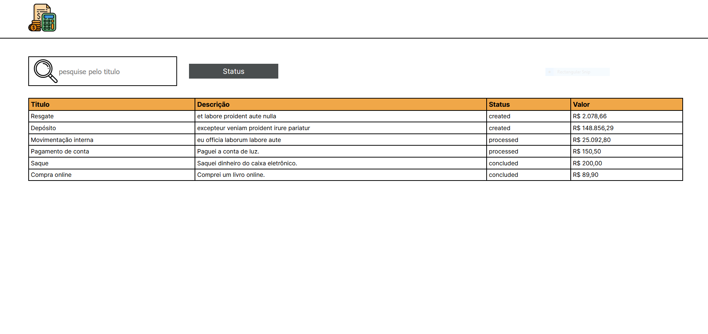
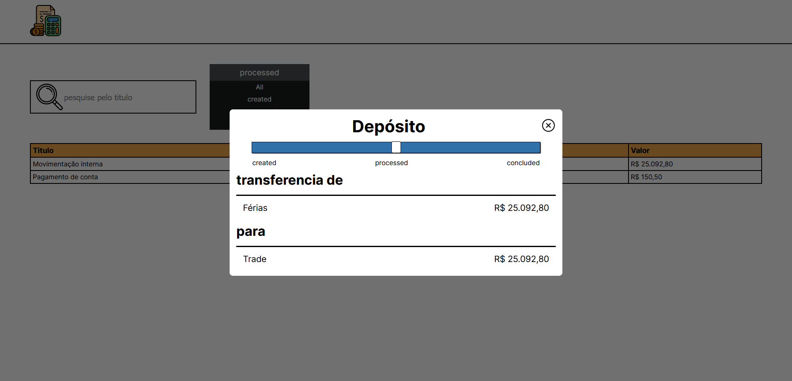

# warren project

## Este projeto visa concluir o desafio proposto pela empresa warren projeto tentando ser o mais fiel o possível sobre o que foi pedido e demonstrando minhas habilidades como desenvolvedor

### Portfolio: <https://denner-portfolio.vercel.app/>

### Github: <https://github.com/denner-august>

### Linkedin: <https://www.linkedin.com/in/denner-bernardes/>

#### Primeiramente gostei bastante do desafio, eu não sou o melhor design, então mantive o mais perto possível do layout baseado nas fotos do projeto

## Observações

- Utilizei React/nextjs
- eu não usei Cypress, pois a última versão do nextjs ainda não suporte
- minha maior dificuldade foi escrever testes (algo que eu quero melhorar muito)
- eu não utilizei libs, assim como foi pedido no projeto
- adicionei mais registros ao projeto para ficar algo mais real
- fiquei com dúvida sobre as informações do modal, como é algo de transações, como foi proposta na descrição do projeto, não deu a entender muito bem como as informações deveriam ser mostradas baseado em como os registros são feitos
- estou disposto a fazer alterações, qualquer sugestão, estou aberto a conversa e melhorias

